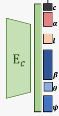

- [1. 论文解读](#1-论文解读)
  - [1.1. 3dmm(FLAME)的参数](#11-3dmmflame的参数)
  - [1.2. diffusionRig](#12-diffusionrig)
- [2. 下载数据](#2-下载数据)
- [3. 安装](#3-安装)
- [4. 修改](#4-修改)
- [5. 使用](#5-使用)
  - [5.1. 重建](#51-重建)
- [6. 报错](#6-报错)


---
## 1. 论文解读

[Learning an Animatable Detailed 3D Face Model from In-The-Wild Images](https://arxiv.org/abs/2012.04012)



$E_c$ 就是代码中的 `self.E_flame = ResnetEncoder(outsize=self.n_param).to(self.device)`, 然后将 resnet 输出维度为 `n_param` 划分为不同含义。

### 1.1. 3dmm(FLAME)的参数
[my_get3dmm.py](./demos/my_get3dmm.py)

```python
deca_code_shape = codedict['shape']     # [B, 100], FLAME parameters (shape 𝜷)
deca_code_exp = codedict['exp']         # [B, 50], FLAME parameters (expression 𝝍)
deca_code_pose = codedict['pose']       # [B, 6], FLAME parameters (pose 𝝍)
```
```python
# whether to use FLAME texture model to generate uv texture map, 
#   set it to True only if you downloaded texture model
deca_cfg.model.use_tex = False  # 默认True
# whether to extract texture from input image as the uv texture map,
#   set false if you want albeo map from FLAME mode
deca_cfg.model.extract_tex = True

# deca_cfg.rasterizer_type = 'pytorch3d'    # 默认 pytorch3d
deca = DECA(config = deca_cfg, device="cuda")
```

### 1.2. diffusionRig

```python
deca_cfg.model.use_tex = True
deca_cfg.model.flame_tex_path = "data/FLAME_texture.npz"
deca_cfg.model.tex_type = "FLAME"
deca = DECA(config=deca_cfg, device="cuda")
```

## 2. 下载数据

```bash
bash fetch_data.sh
```
其实就是下载

必选：
- `deca_model.tar`(DECA的权重文件)

  Visit [this page](https://drive.google.com/file/d/1rp8kdyLPvErw2dTmqtjISRVvQLj6Yzje/view) to download the pretrained DECA model.
  
  链接：https://pan.baidu.com/s/1vlc6cYfeZ2-WEXqNkcMr0A?pwd=7fgl 
  
  提取码：7fgl

- `generic_model.pkl`(FLAME模型的权重文件)
  
  Visit [this page](https://download.is.tue.mpg.de/download.php?domain=flame&resume=1&sfile=FLAME2020.zip) to download `FLAME 2020`

  把`data/FLAME2020/generic_model.pkl`移动出来`data/generic_model.pkl`
  
  链接：https://pan.baidu.com/s/1ejoL6dezMNoj_vPX4Dd-nA?pwd=ngw8 
  
  提取码：ngw8

optional:
- `FLAME_texture.npz`

  有了它，就不用 `'FLAME_albedo_from_BFM.npz'`(https://github.com/TimoBolkart/BFM_to_FLAME)。
  
  需要设置
  ```python
  deca_cfg.model.use_tex = True
  deca_cfg.model.tex_path = "data/FLAME_texture.npz"
  deca_cfg.model.tex_type = "FLAME"
  ```
  
  Visit [this same page](https://download.is.tue.mpg.de/download.php?domain=flame&resume=1&sfile=TextureSpace.zip) to download the `FLAME texture space` and extract `FLAME_texture.npz`.

  链接：https://pan.baidu.com/s/1t0inEFVgQA4FyoSAdEOUeQ?pwd=yv65 
  提取码：yv65
```
data
├── FLAME2020
│   ├── Readme.pdf
│   ├── female_model.pkl        ###
│   └── male_model.pkl          ###
├── deca_model.tar              ###
├── FLAME_texture.npz           ###
├── fixed_displacement_256.npy
├── generic_model.pkl           ###
├── head_template.obj
├── landmark_embedding.npy
├── mean_texture.jpg
├── texture_data_256.npy
├── uv_face_eye_mask.png
└── uv_face_mask.png
```

## 3. 安装

- windows 下用都不行。`rasterizer_type = 'standard'`，编译错误；`'pytorch3d'`编译也错误。

- linux：
  
  [pytorch3d](https://github.com/sword4869/pytorch3d/blob/main/README2.md)
  
  不用 `pytorch3d` 也可以: `deca_cfg.rasterizer_type = 'pytorch3d'` 改为 `standard` 就行。
- python 3.10 才行，3.11不行
  
  涉及到 chumpy 模块，这个模块使用 inspect 模块。
  ```python
  want_out = 'out' in inspect.getargspec(func).args
                              ^^^^^^^^^^^^^^^^^^
  
  AttributeError: module 'inspect' has no attribute 'getargspec'. Did you mean: 'getargs'?
  ```
  https://stackoverflow.com/questions/74585622/pyfirmata-gives-error-module-inspect-has-no-attribute-getargspec

    
  老的chumpy 会 from numpy import bool, int, float, complex, object, unicode, str, nan, inf

## 4. 修改
```bash
(pytorch3d) lab@eleven:~/project/DECA$ python demos/demo_reconstruct.py -i TestSamples/examples --saveDepth True --saveObj True
Traceback (most recent call last):
  File "/home/lab/project/DECA/demos/demo_reconstruct.py", line 131, in <module>
    main(parser.parse_args())
  File "/home/lab/project/DECA/demos/demo_reconstruct.py", line 40, in main
    testdata = datasets.TestData(args.inputpath, iscrop=args.iscrop, face_detector=args.detector, sample_step=args.sample_step)
               ^^^^^^^^^^^^^^^^^^^^^^^^^^^^^^^^^^^^^^^^^^^^^^^^^^^^^^^^^^^^^^^^^^^^^^^^^^^^^^^^^^^^^^^^^^^^^^^^^^^^^^^^^^^^^^^^
  File "/home/lab/project/DECA/decalib/datasets/datasets.py", line 71, in __init__
    self.face_detector = detectors.FAN()
                         ^^^^^^^^^^^^^^^
  File "/home/lab/project/DECA/decalib/datasets/detectors.py", line 22, in __init__
    self.model = face_alignment.FaceAlignment(face_alignment.LandmarksType._2D, flip_input=False)
                                              ^^^^^^^^^^^^^^^^^^^^^^^^^^^^^^^^
  File "/home/lab/miniconda3/envs/pytorch3d/lib/python3.11/enum.py", line 783, in __getattr__
    raise AttributeError(name) from None
AttributeError: _2D
```
```python
self.model = face_alignment.FaceAlignment(face_alignment.LandmarksType.TWO_D, flip_input=False)
```

## 5. 使用

### 5.1. 重建
```python
(ldm) lab@eleven:~/project/DECA$ python demos/demo_reconstruct.py -h
usage: demo_reconstruct.py [-h] [-i INPUTPATH] [-s SAVEFOLDER] [--device DEVICE] [--iscrop ISCROP] [--sample_step SAMPLE_STEP] [--detector DETECTOR] [--rasterizer_type RASTERIZER_TYPE]
                           [--render_orig RENDER_ORIG] [--useTex USETEX] [--extractTex EXTRACTTEX] [--saveVis SAVEVIS] [--saveKpt SAVEKPT] [--saveDepth SAVEDEPTH] [--saveObj SAVEOBJ] [--saveMat SAVEMAT]
                           [--saveImages SAVEIMAGES]

DECA: Detailed Expression Capture and Animation

options:
  -h, --help            show this help message and exit
  -i INPUTPATH, --inputpath INPUTPATH
                        path to the test data, can be image folder, image path, image list, video
  -s SAVEFOLDER, --savefolder SAVEFOLDER
                        path to the output directory, where results(obj, txt files) will be stored.
  --device DEVICE       set device, cpu for using cpu
  --iscrop ISCROP       whether to crop input image, set false only when the test image are well cropped
  --sample_step SAMPLE_STEP
                        sample images from video data for every step
  --detector DETECTOR   detector for cropping face, check decalib/detectors.py for details
  --rasterizer_type RASTERIZER_TYPE
                        rasterizer type: pytorch3d or standard
  --render_orig RENDER_ORIG
                        whether to render results in original image size, currently only works when rasterizer_type=standard
  --useTex USETEX       whether to use FLAME texture model to generate uv texture map, set it to True only if you downloaded texture model
  --extractTex EXTRACTTEX
                        whether to extract texture from input image as the uv texture map, set false if you want albeo map from FLAME mode
  --saveVis SAVEVIS     whether to save visualization of output
  --saveKpt SAVEKPT     whether to save 2D and 3D keypoints
  --saveDepth SAVEDEPTH
                        whether to save depth image
  --saveObj SAVEOBJ     whether to save outputs as .obj, detail mesh will end with _detail.obj. Note that saving objs could be slow
  --saveMat SAVEMAT     whether to save outputs as .mat
  --saveImages SAVEIMAGES
                        whether to save visualization output as seperate images
```
```bash
python demos/demo_reconstruct.py -i TestSamples/examples --saveDepth True --saveObj True
```

超大分辨率的图片虽然可以直接作为`-i`输入得到结果，但是得到的landmark是不准的。而你自己先手动resize图片，传入resized 图片，那么得到的landmark就是准确的。


## 6. 报错

`decalib/utils/renderer.py`

```python
def set_rasterizer(type = 'pytorch3d'):
    if type == 'pytorch3d':
        global Meshes, load_obj, rasterize_meshes
        from pytorch3d.structures import Meshes
        from pytorch3d.io import load_obj
        from pytorch3d.renderer.mesh import rasterize_meshes
    elif type == 'standard':
        global standard_rasterize, load_obj
        import os
        from .util import load_obj
        # Use JIT Compiling Extensions
        # ref: https://pytorch.org/tutorials/advanced/cpp_extension.html
        from torch.utils.cpp_extension import load, CUDA_HOME
        curr_dir = os.path.dirname(__file__)
        standard_rasterize_cuda = \
            load(name='standard_rasterize_cuda', 
                sources=[f'{curr_dir}/rasterizer/standard_rasterize_cuda.cpp', f'{curr_dir}/rasterizer/standard_rasterize_cuda_kernel.cu'], 
                extra_cuda_cflags = ['-std=c++14']) # cuda10.2 is not compatible with gcc9. Specify gcc 7 
        from standard_rasterize_cuda import standard_rasterize
        # If JIT does not work, try manually installation first
        # 1. see instruction here: pixielib/utils/rasterizer/INSTALL.md
        # 2. add this: "from .rasterizer.standard_rasterize_cuda import standard_rasterize" here
```

```
$ python demos/demo_reconstruct.py -i TestSamples/examples --saveDepth True --saveObj True
/home/lab/miniconda3/envs/gaussian_splatting/lib/python3.7/site-packages/torchvision/models/_utils.py:209: UserWarning: The parameter 'pretrained' is deprecated since 0.13 and will be removed in 0.15, please use 'weights' instead.
  f"The parameter '{pretrained_param}' is deprecated since 0.13 and will be removed in 0.15, "
/home/lab/miniconda3/envs/gaussian_splatting/lib/python3.7/site-packages/torchvision/models/_utils.py:223: UserWarning: Arguments other than a weight enum or `None` for 'weights' are deprecated since 0.13 and will be removed in 0.15. The current behavior is equivalent to passing `weights=None`.
  warnings.warn(msg)
creating the FLAME Decoder
trained model found. load /home/lab/git/DECA/data/deca_model.tar
Traceback (most recent call last):
  File "demos/demo_reconstruct.py", line 131, in <module>
    main(parser.parse_args())
  File "demos/demo_reconstruct.py", line 46, in main
    deca = DECA(config = deca_cfg, device=device)
  File "/home/lab/git/DECA/decalib/deca.py", line 50, in __init__
    self._setup_renderer(self.cfg.model)
  File "/home/lab/git/DECA/decalib/deca.py", line 53, in _setup_renderer
    set_rasterizer(self.cfg.rasterizer_type)
  File "/home/lab/git/DECA/decalib/utils/renderer.py", line 41, in set_rasterizer
    extra_cuda_cflags = ['-std=c++14', '-ccbin=$$(which gcc-7)']) # cuda10.2 is not compatible with gcc9. Specify gcc 7 
  File "/home/lab/miniconda3/envs/gaussian_splatting/lib/python3.7/site-packages/torch/utils/cpp_extension.py", line 1214, in load
    keep_intermediates=keep_intermediates)
  File "/home/lab/miniconda3/envs/gaussian_splatting/lib/python3.7/site-packages/torch/utils/cpp_extension.py", line 1450, in _jit_compile
    return _import_module_from_library(name, build_directory, is_python_module)
  File "/home/lab/miniconda3/envs/gaussian_splatting/lib/python3.7/site-packages/torch/utils/cpp_extension.py", line 1844, in _import_module_from_library
    module = importlib.util.module_from_spec(spec)
  File "<frozen importlib._bootstrap>", line 583, in module_from_spec
  File "<frozen importlib._bootstrap_external>", line 1043, in create_module
  File "<frozen importlib._bootstrap>", line 219, in _call_with_frames_removed
ImportError: /home/lab/.cache/torch_extensions/py37_cu116/standard_rasterize_cuda/standard_rasterize_cuda.so: cannot open shared object file: No such file or directory
```

无法解决